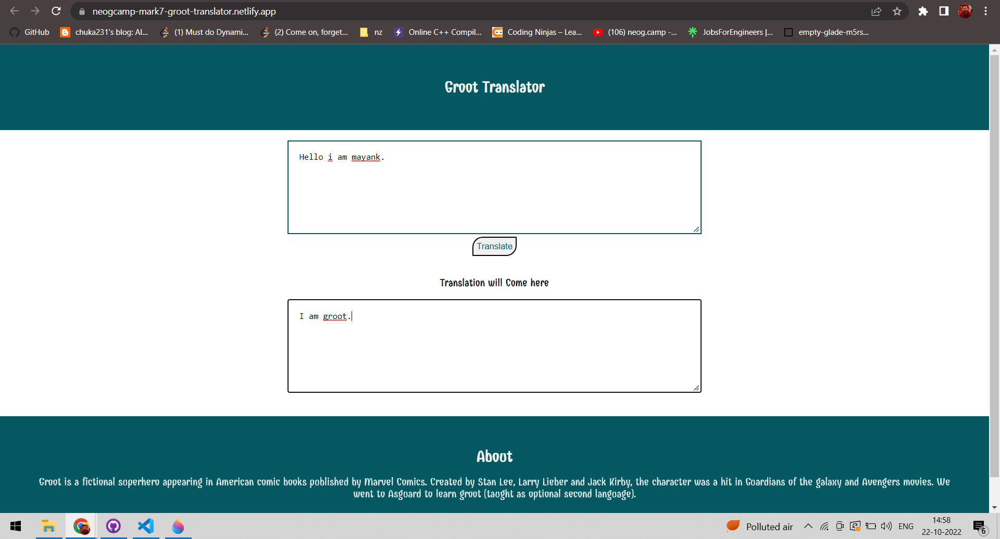

# English to Groot translator using vanilla javascript
## About:
- App takes input as english from the user and converts text to groot's language.
- The converted text is fetch and displayed using api. 
- Used funtranslation API for translation.
- Link for the app is [here](https://neogcamp-mark7-groot-translator.netlify.app/).

## Tech Stack used:
1. HTML
2. CSS
3. JavaScript
4. Netlify(for deployment)

